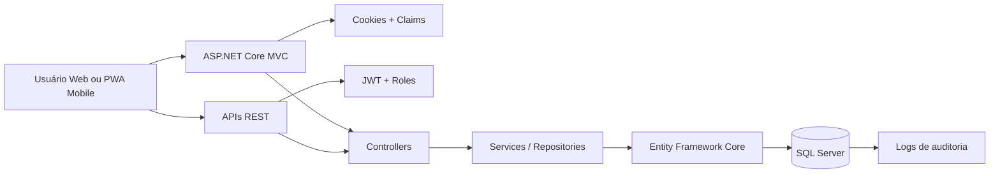

# Arquitetura do CorvusIAM

```mermaid
flowchart LR
    U[Usuário Web ou PWA Mobile] --> W[ASP.NET Core MVC]
    U --> A[APIs REST]
    W --> AU[Cookies + Claims]
    A --> J[JWT + Roles]
    W --> C[Controllers]
    A --> C
    C --> S[Services / Repositories]
    S --> EF[Entity Framework Core]
    EF --> DB[(SQL Server)]
    DB --> L[Logs de auditoria]
```

As aplicações web e PWA compartilham as APIs REST. A autorização usa perfis; dados de senha não são retornados pelos DTOs.
