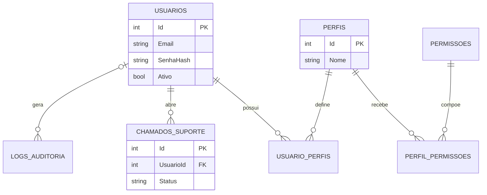

# MER — CorvusIAM

```mermaid
erDiagram
    USUARIOS ||--o{ USUARIO_PERFIS : possui
    PERFIS ||--o{ USUARIO_PERFIS : define
    PERFIS ||--o{ PERFIL_PERMISSOES : recebe
    PERMISSOES ||--o{ PERFIL_PERMISSOES : compoe
    USUARIOS ||--o{ CHAMADOS_SUPORTE : abre
    USUARIOS o|--o{ LOGS_AUDITORIA : gera
    USUARIOS { int Id PK
      string Email
      string SenhaHash
      bool Ativo
    }
    PERFIS { int Id PK
      string Nome
    }
    CHAMADOS_SUPORTE { int Id PK
      int UsuarioId FK
      string Status
    }
```

O modelo físico completo está em `DatabaseScript.sql`.
